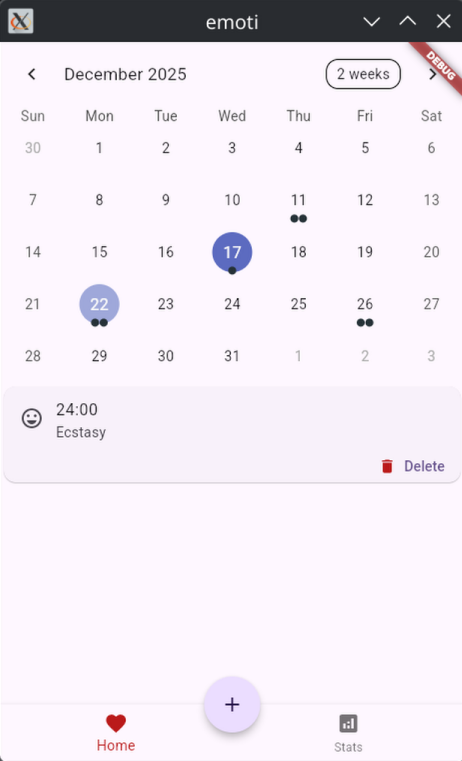
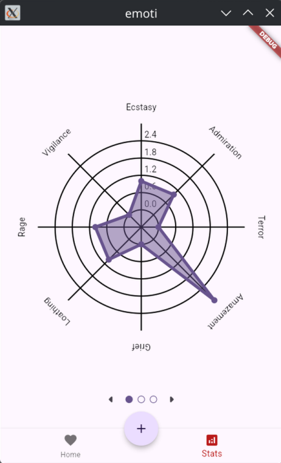
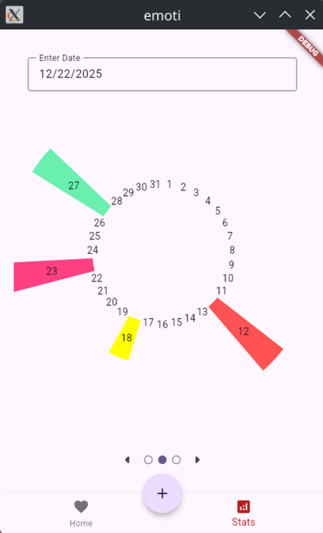

# Emoti

Work-in-progress project for a small mood-tracking app.
This will lateron follow the [emotion classification theory](https://en.wikipedia.org/wiki/Emotion_classification) by "Tiffany Watt Smith".

The app is made using [Flutter](https://flutter.dev/), management of environment is done with [fvm](https://fvm.app/).

Currently missing a persistent storage solution, as the sqflite package is not directly compatible with "web" and "android" targets.

      